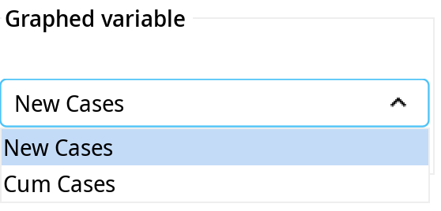
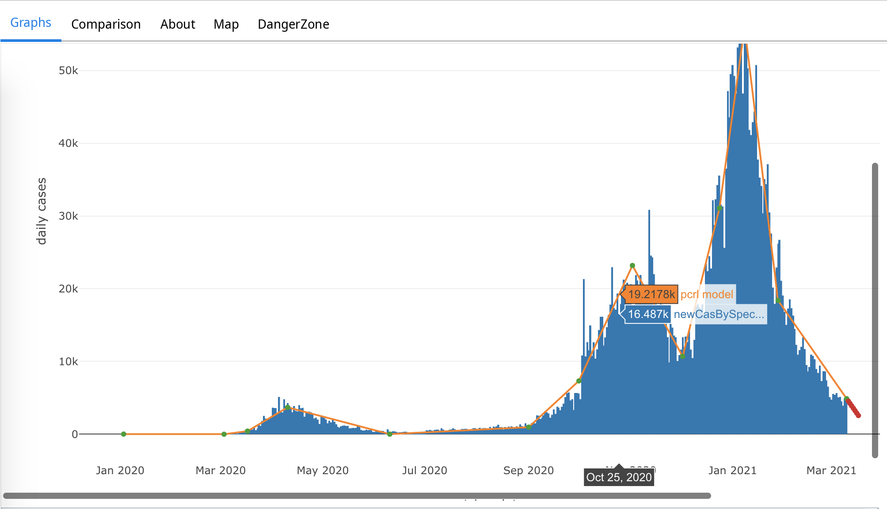
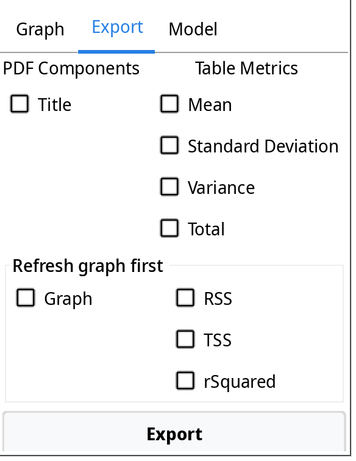
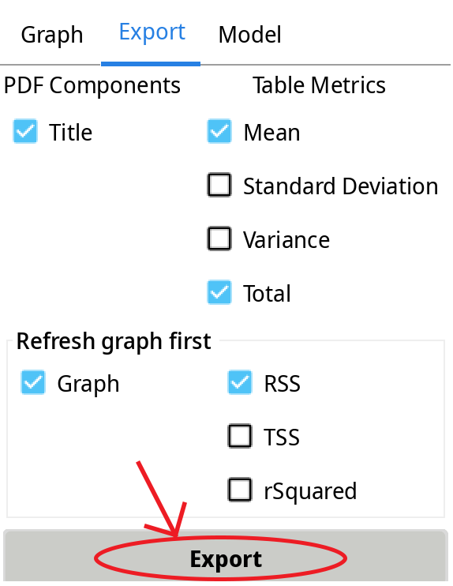
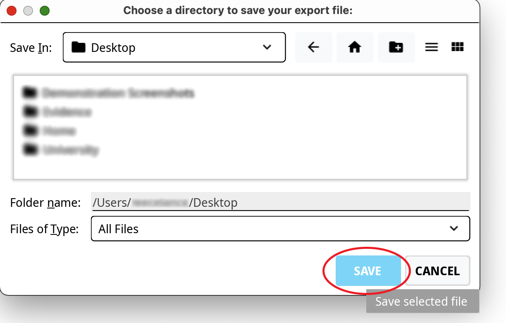
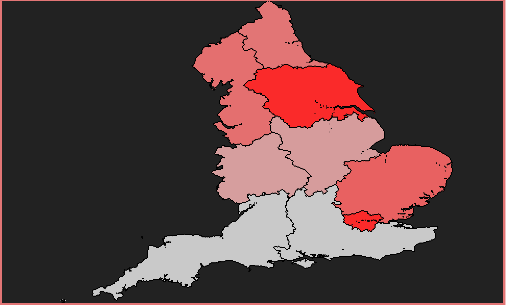

# Product Demonstration Report

## Graph & Metrics
When running main, the product will have an initial display like this.

**Graph Tab**

The graph tab has several buttons that is needed to be use to get the graph to display.  

**1) First Step**

For the graph to reveal, first click the fetch data button to get the latest data that will be displayed in a table.

**2) Second Step**

Next, select the type of graph that you want the product to display.

**3) Third Step**

Afterwards, select the type of cases that you want the graph to display.

**4)Fourth Step**

Lastly, press refresh graph button to get the final graph.

**4)Fourth Step (Metrics)**

The metrics information will be automatically display once selecting the type of graph and type of graph variable. 
  
The RSS, TSS and rSQUARED metrics will display for graph type PiecewiseContinuousLR only.

**Final Display**
    
The final display should look like this. You can scroll your pointer along the graph to access some useful informations.

## Country Comparison Tab
Upon opening up the country comparison tab, you are presented with two 'unkown region' flags representing where the country flags will be, two drop downs on either side and a 'Refresh Data' button at the bottom.

When the 'Refresh Data' button is pressed, all the country Covid data is represented in two seperate tables and the flags refresh to represent the country currently showing in the table below it. The two dropdown tabs initialise with the UK showing on the left side as the entire product is mainly focusing on data in the UK, but both dropdown options can be changed to show any other country in the world.

Each of the country tables are separated into two sections by a very thin line. 

The upper section shows all the numerical figures while the lower section shows three different rates calculated from the data, as seen below.

The upper sections of each country table have black chevrons against every data count. A black up-arrow chevron shows that, for that particular data count, the number is higher than that of the compared country. The opposite is shown by the black down-arrow. In the event that the data count is the same for both countries, an equals sign is shown.

The lower section of each country table has coloured chevrons. These chevrons are for the purpose of representing which rates are numerically higher/lower and whether that would impact the country positively/negatively in the fight agains coronavirus. An up-arrow chevron simply represents a higher numerical rate, as compared to a lower down-arrow chevron. In terms of colour, a red chevron represents that a rate impacts a country more negatively than it's comparison, while a green chevron shows that a rate has a more positive impact than it's comparison.

## PDFs

In the Graphs tab, there is a section in the bottom right containing tabbed panes:

In this section at the top there is an Export tab you can select:

The export tab has check boxes which allows the user to select which components they want to use in the PDF:

There is also a check box in the Map tab located at the top of the page:

The check box is on the right hand side as shown in the image below:

This allows the user to have the map that is in view to be in the PDF is the check box is selected:

Once the user has chosen which components they want to include in the PDF, they can press the export button on the Export tab:

This brings up a pop-up file chooser allowing the user to choose a location on their file system to save the PDF file:

Then the user can export the PDF file by pressing the save button:

The PDF file is then save in that location on the user's file system as shown in the image below:

The image below is one example of the many possible outputs of the customisable PDF:

## Maps

The map tab is located at the top of the main page as show below:

This tab has many features including the interactive map, key, table, and map controls. The comboBozes located on the right hand side control what is shown in the map:

The first comboBox allows the user to select the map type, when clicked, the map content changes.

The images below show what is displayed for each map type:

- Regions

- UTLA

- LTLA

The second comboBox allows the user to select the map style, this changes the colours used in the map and the key.

The image below shows one example (Style: Pheela) of the many style options the user has to customise the map:

The final comboBox allows the user to select the mapped variable, the options are shown below:

The image below shows one example (Variable: TotalDeaths) of the four variable options the user has the choice of to be mapped:

The key on the left of the page shows the user the value of the variable of each colour. This changes depending on the graph type, style and mapped variable.

The map has many interactive features as well as the customisable options already discussed.

### Map interactive features

- The user may zoom in and out of the map using the scroll-bar on their mouse or touchpad:

- The user can click and drag their mouse in order to pan around the map.

- The user can also click on any region and it will be highlighted in white as shown below:

The final component of the map tab is the table which displays the data to the user based on the chosen map type. The rows in the table are sorted into ascending order based on the chosen map variable in the third comboBox on the right.

Example of LTLA table sorted by Cases

Example of LTLA table sorted by DeathsTotal

The final feature in the map tab in the link between the map and the table. When the user selects a region in the map, the corresponding row is selected in the table:

Also, when the user selects a row in the map, the corresponding region is selected in the table:

The user may also drag their mouse down each row through the table and the corresponding regions will be selected.

## Danger Zone

If the user wishes to delete the cached data, they may do so by selecting the image on the right saying "YYYYYESSSSS"

