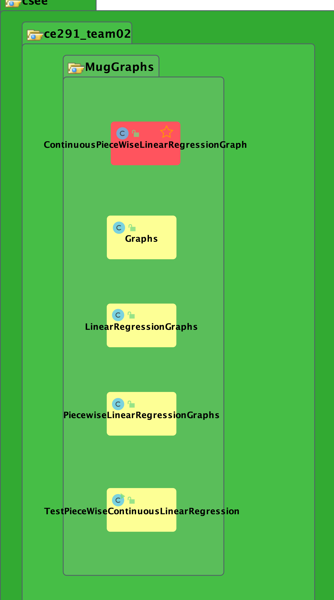

# Team Implementation Report
*This section should describe the technical details of your implementation.  The subheadings and italicised text below may be used to guide you.*

## Technical Diagrams 

## Complete UML Diagram 

-  This photo represents a complete UML Diagram of the project.

## Colour Coded Map

-   This photo represents a UML Diagram of the package "Colour Coded Map"

## Data 
-   This package will be divided in 3 sections, the first photo will show the UML Diagram of the Data Package, the second photo will show the the UML Diagram of one of the two packages that are inside the Data package, and last but not least, the third photo will show the other package.

-    Data Package

-    Data.LmaoNinjaApiClient

-    Data.UkCovdiapiClient

## Forms

-   This photo will show the UML Diagram of the Form package.

## Models

-   This photo will show the UML Diagram of the Models package.

## Mug Graphs

-   This photo will show the UML Diagram of the Mug Graphs package.

## Mug Stats

-   This photo will show the UML Diagram of the Mug Stats package.

## PDF Export

-   This photo will show the UML Diagram of the PDFExport package.

## Classes Outside Packages

-   This photo will show the UML Diagram of the classes that are inside the main package but outside any other package.

## Technical Description
At the start we were mostly discussing what direction we are going to take. We have opted for a desktop application as it was something everyone had already at least a little bit of experience in. Swings may be old, but it is mature and teher is some decent tooling which made our lifes easier. On the other hand in combination with the next topic, sometimes it's just better to take the red pill right from the get go. The very first feature we agreed on was howare we going to graph our data, since that was one of the major features for the MVP. Instead of creating our own graphs from scratch, we took on what ended up being an even more costlier challenge. JCEF Java Chromium Embedded Framework is a project that wraps the OS Chromium browser and makes it widely available for tight integration within custom applications in the Java world. we wanted to kill two flies in one go. After our initial research, we have discovered that we could display the graphs in the browser and use the html for the PDF export as well. It took us close to two weeks to get together a hacky solution and we stuck with it. Because of JCEF, we had to lower our Java language version down to 1.8. We dicovered another problem, the version we were using had a bug which prevented the browser from functioning correctly on a mac. Thus our teammates using macs had to turn off certain features and could not work on the graphing at all. This and the fact that we  could only leverage bi-directional channel in the brwoser workflow, we did not have any feedback, was caused by not compiling JCEF from source. We decided against that simply because we have identified other features in which out time invested could yield better results. It was around this time that we were experimenting with traversing html templates to create our pdf exports. Trvaversing became too complex too quick and it was either our inexpirience with the library or our very inconsitent results that cause us to switch to a simplier approach which would solve the same exact problem. That is how do we get the data into our documents. Templating engine with some kind of tokenisation seemed to be the simpliest and most effective solution after our initiall struggles. This was a point where we had our main feature ready for our MVP and with that, most of the 'hard' work has been done. Now we only needed to continue on and mix and match features that were already in the solution to create value for the user.
As for our own contribution. we started by implementing simple linear regression, which in turn seemed to be very inappropriate for the type of data that we were dealing with,, but it was a starting point. We were on the lookout for a solution to piecewise linear regression. We did think at first how to DIY eyeball it, but decided to do more thorought research on the topic. One of the options that came up often in our searches was the MARS algorithm by Jerome H. Friedman. After a deeper dive into the topic we decided to drop it and search for an easier method since MARS seemed too complex. We needed something much simplier. 
After a thourough search, we found a [paper] (https://golovchenko.org/docs/ContinuousPiecewiseLinearFit.pdf) that described the process using least squares regression applied to different segments of the graph. After a consultation with Dr Dan Brawn, who helped us understand the maths side of things, we went ahead and implemented it. We needed needed to finish the equation the factor our wanted y-values. After that we do multiple sweeps to let the points converge and the final result is a spline (collection of lines) fitted to the data. We made the choice to go with predefined knot values as the calculation of these would be much more complex.
When we started to think about what other fetures we could add, we thought of country comparison and colour coded map. Because we have already developed generic caching data source classes, it was feasible for us to quickly start getting and handling data from different sources. We only needed to implement the API client per data source. In case of UK Covid-19 dashboard, we are reusing the same client and caching it's different http calls.
For the map, we had to scrape the web for geo spatial data in GeoJSON files. There is a scrip that does the fetching, conversion, scaling and finally resterization with serialization into a custom file. Because the rasterized files are quite big, we have decided to bundle tme in a zip archive, which the covid-mdf application is able to read and parse. The map itself actually does pixel by pixel rendering, which is incredibly inefficient, but our data is small enough for it to be usefull. 

## Algorithms and Data Structures
 - Unfortunately there was not enough time left for us to work out this section.

We are using piecewise continuous linear regression for firring our main graph
## Imported Libraries (Filip)
*List any 3rd party libraries that were used and describe what functionality they provided.*
## jitpack.io
- [source](https://jitpack.io)
- package repository for Git
- enables us to consume dependencies built straight form GitHub
## bintray
- [source](https://api.bintray.com/maven/flyingsaucerproject/maven/org.xhtmlrenderer:flying-saucer)
## material-ui-swing
- [source](io.github.vincenzopalazzo)
- makes our components look better, following the older material design language
## okhttp
- com.squareup.okhttp3
- handling http requests, fetching online data
## org.slf4j
- transient dependency, we do not actually make use of itextpdf
- logging
## tablesaw-jsplot
- tech.tablesaw
- we mainly use it to generate graphs
- export graphs to html/javascript for view in our browser
## journey
- com.github.codebrig
- JCEF wrapper, makes it easier to integrate a fully fledged chromium browser
- we use the browser as an output pane for our graphing
## compiler
- com.github.spullara.mustache.java
- templating engine that we use to inject our html templates
with information/html/javascript
## itextpdf
- com.itextpdf
- enables us to reuse our html templates for pdf export
## com.itextpdf.tool
- xmlworker
- initially used to parse and fill the html templates
- later scrapped in favour of injecting our data instead of traversing
## xhtmlrenderer
- org.xhtmlrenderer
- flying-saucer-pdf
## junit-jupiter-api
- org.junit.jupiter
- unittesting our solutoin
## junit-jupiter-engine
- org.junit.jupiter
## swagger-annotations
- io.swagger.core.v3
- allows us to consume Open API spec files and generate appropriate clients
## logging-interceptor
- okhttp
## com.squareup.okhttp
- transient dependency
## gson 
- com.google.code.gson
- deserialization and serialization of data
- reading http responses, keeping our cache files
- reading compressend reponss
## gson-fire
- io.gsonfire

## Known Issues
* The browser responsible for showing the graph does not display for MacOS 6 version 11 users. There are currently no workarounds to this.

* The pdf can only include one graph at a time at the moment due to screenshot only capturing the graph visible at the time. There are currently no workarounds to this.

* Application is not compatible with some screen resolutions. We have created the application in the most optimal size to accommodate for as many different resolutions as possible.
