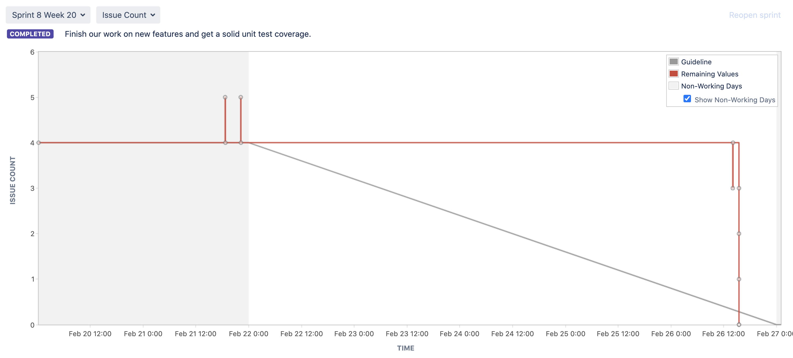

# Project Management Log

## Project management discussion

-How well the group has worked together?

Each team member has put forth exceptional effort and dedication. All was willing to assist with any issues that occurred during the project.

-How well the project is progressing?

We practised splitting into subgroups,to complete specific tasks at each scrum meeting. Each task/user-story assigned should be completed before the target date or the end of the sprint. As a result of doing this on each sprint, our project has been progressing smoothly towards the final completion of the final product.

Scrum meetings were held on Fridays every week. Since we decided to divide each task into groups for each task, each group would present what they accomplished in the previous sprint as well as any issues they encountered. We will discuss which task to follow for the next sprint after each group has demonstrated.

We boost the effectiveness of the scrum meetings by including an overview of the task we worked on during the previous sprint and what we intend to focus on during the next sprint in our own personal subtask in the standup meeting task.

Another way to boost the efficiency of scrum meetings is to rotate the scrum master at each one. The scrum master will be selected at the beginning of each sprint and will hold the scrum meeting at the end of each sprint. Every member of the team will have the ability to learn how to become a scrum master as a result of this.

One of the communication issues that came up during the project was the inability to communicate with a group member. We attempted to resolve this issue within the group by privately messaging him on Whatsapp and inviting him to our standup meetings and class. The member, on the other hand, did not respond.

This resulted in a slight slowdown in the project because the task assigned to the member was not updated. However, the task has been reassigned to the other members of the group so that the project will not be disrupted.

Also, since we are studying in the midst of a COVID-19 pandemic, some of the group members are still in their home countries. The concerns that were faced during the project were that if we were to create a standup meeting, we would have to ensure that we took into account the time zone difference of the other group members as well.

For example, if we arranged a standup meeting for 8 p.m. BST and the other group members reside in a time zone that is 8 hours ahead of us, it would be difficult for them to attend a meeting at 4 a.m.

The usefulness of the group setting up some standup meetings, was to discuss any unspoken important materials that we were supposed to discuss or any updates on the project. For instance, on this particular stand up meeting, we discussed about some additional materials that needed to be redone and updates on certain materials.

Sprint 9 Wednesday standup meeting: (https://cseejira.essex.ac.uk/browse/A291002-291)

## Sprint Burndown Charts

**Sprint 1:**

We did not record a standup meeting on Jira during sprint 1

**Sprint 2:**

We did not record a standup meeting on Jira during sprint 2

**Sprint 3:**

Link to sprint 3 standup meeting:
https://cseejira.essex.ac.uk/browse/A291002-86

**Sprint 4:**

Link to sprint 4 standup meeting:
https://cseejira.essex.ac.uk/browse/A291002-130

**Sprint 5:**

Link to sprint 5 standup meeting:
https://cseejira.essex.ac.uk/browse/A291002-167

**Sprint 6:**

Link to sprint 6 standup meeting:
https://cseejira.essex.ac.uk/browse/A291002-195

**Sprint 7:**

Link to sprint 7 standup meeting:
https://cseejira.essex.ac.uk/browse/A291002-218

**Sprint 8:**

Link to sprint 8 standup meeting:
https://cseejira.essex.ac.uk/browse/A291002-270

**Sprint 9:**

Link to sprint 9 standup meeting:
https://cseejira.essex.ac.uk/browse/A291002-291

## Burndown-Charts Discussion

Our burndown chart is very inconsistent, this is because that when story points are allocated, they are assigned to the user-story/task itself, and while working on the user-story/task, we build subtasks to keep track of what we are doing, which ensures that the task is not marked "done" until all the subtasks that have been created, are finished.That is why a better unit of measuring our team sprint burndown are issue counts.

The burndown chart of the issue count in sprint 7, for example, provides a clearer picture of how the team performed during sprints. You will see how certain problems are checked off and marked as complete, as well as how new issues are being added to the sprint.

Finally, the team should be able to increase their independency and not rely on other team members to complete subtasks in order to boost velocity and estimation capacity for potential sprints.

## Product Backlog

## Other Areas
## Use of Jira links in GitLab

When making commits to GitHub, we made sure to include links to the Jira sub-tasks that corresponded to the commit's changes.

