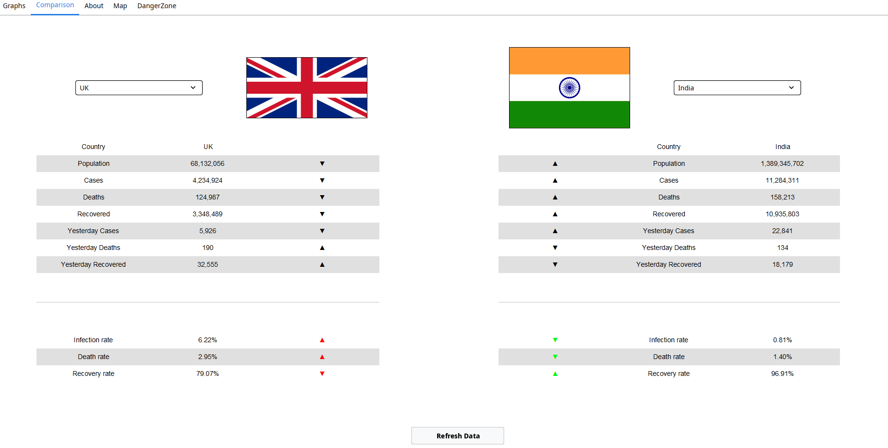

# Test report

## Testing performed

### Table
-   When the program is being first being runnned the table does not show any of the data, the goal is to be able to see all the data since it started up to the date by clicking the "Fetch Data" button. 

### Graph
-   For this section, we wanted to be able to switch between graphs and also to output the graph that was chosen by clicking the "Refresh Graph" button. In addition to that, if this button is pushed before fetching data for the table it will not output anything. We also added a feature where you can switch between showing the cumulative cases or the new cases.

### Metrics

-   At first, the metrics are not shown in the Metrics table, only the name of each metric will appear on the table, it will only show the updated output of the metrics when switching between Graphs.

### Export Tab

-   This tabs goal allows you to export in PDF form the Graph the user chose with all the metrics that were selected by the user. 

### Comparison Tab
-   The Comparison table is very similar to the Table itself, when switching tabs it will not show any type of data, only when pushing the "Refresh Data" button the program will allow seeing the data of all the countries. This tab goal is also to let you choose which country you want to compare in terms of population, death rate because of COVID-19, the people that have recovered from this virus, etc...

## Map Tab 
-   The Map tab is very similar to the Graph tab, but instead of showing the graph it shows the Map and you can change the regions that you want to see and even the colours of the Map. We also added a feature where you can change the data of the Map by switching between Female cases, Male cases, Total Cases, and deaths.

## Model Tab 
-   This tab will allow you to output up to sixty prediction days in the Graph.

## Automatic Testing:
The different types of tests conducted on the code specifically focused on the following areas of code:

* Data handling and API functionality
* Rendering and Resolving of Flag Images
* Graph Equations and Lines
* PDF Creation and Exporting

### Data Handling and API Functionality
- Tests were created to ensure that the code for the API's delivered correct data for both UK Covid Data and other country's data.

- Within these tests, we tested that all the required data was fetched and that the data was mapped correctly upon integration into the application.

- Other tests also tested the cache handler code. These tested whether the cache handler code could notice when the cached files were expired as well as if the retrieval of new data was necessary.

### Rendering and Resolving
- These tests focused particularly on the retrieval and resolving of the country flag images. More specifically, we tested to ensure that if a known/unknown country was selected, the known/unknown flag would show up in the application, as required.

### Graph Equations and Lines
- Multiple tests were created in this section to ensure that the graphs represented within the application carried with them accurate equations and representation of data.

- For starters, we tested that the correct equations for calculating the correct y-intercept and gradient were integrated into the code. We also tested that the correct number of segments, segment boundaries, and knots were created no matter what amount of data was entered.

- Moreso, we ensured that a correct Piecewise Linear Regression spline would be formed upon retrieval of the different segments of data. 
In addition to this, we also tested that we were able to retrieve the correct y-axis values for both inner and outer segment boundaries.

### PDF Creation and Exporting
- When it came to these tests, we mostly focused on ensuring the pdf would exist upon running the code. We more so tested whether the pdf would not be created upon having false parameters and that the pdf template on which the pdf relied was also created. Another test carried out on the pdf was to ensure that it was not empty upon creation.

### JUnit Coverage
- When it came to the specifics, 93% of classes and 45% lines of the UK Covid API code were covered while 57% of methods of the cache handler were covered. 

- 100% classes of the Graph Model code were covered while another 45% classes of code to do with PDF exporting were covered.

- As expected, however, 100% code coverage is not a sure guarantee of anything other than adequate testing. Not all code is testable by nature and thus we made sure to test all the code we felt was most vital within the operations of the application.