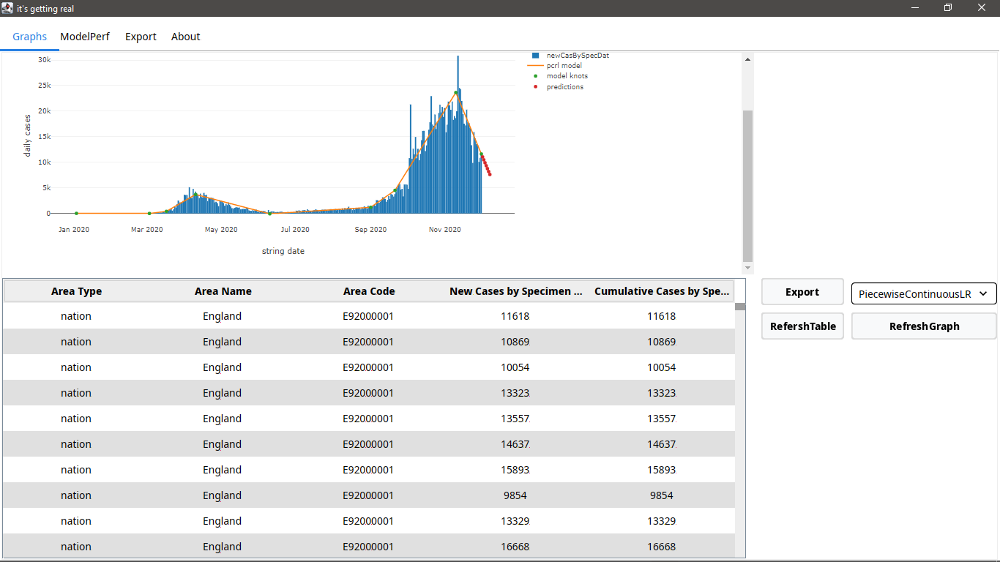

# Product Demonstration Report

## Startup Window

Upon startup, the application opens up a window seen below.

## Graphs Tab

On the right hand side, this tab contains 3 buttons('Export', 'RefreshTable', 'RefreshGraph') and a combination box which allows you to select different graphs to display on the left hand side. 

Upon clicking the button 'RefreshTable', the Covid data appears within a table as shown below.

Upon clicking on the combination box, 3 different graph options appear('Piecewise Continuous Linear Regression', 'Piecewise Linear Regression', 'Linear Regression') as shown below.

### Piecewise Continuous Linear Regression

When 'PiecewiseContinuousLR' is selected from the combination box, and 'RefreshGraph' is clicked on, the graph will show on the left hand side as seen in the 2 screenshots below. (full graph could not fit within one screenshot)

### PiecewiseLinear Regression
When 'PiecewiseLR' is selected from the combination box, and 'RefreshGraph' is clicked on, the graph will show on the left hand side as seen in the 2 screenshots below.(full graph could not fit within one screenshot)

### Linear Regression
When 'LinearRegression' is selected from the combination box, and 'RefreshGraph' is clicked on, the graph will show on the left hand side as seen in the 2 screenshots below.(full graph could not fit within one screenshot)

### PDF Export Button
When the export button is clicked, a frame appears that allows the user to select where they would like to save the PDF file. The user chooses a file location and clicks on the save button. The frame then closes and the pdf file is saved in the chosen file location.

## ModelPerf Tab 
When 'ModelPerf' tab is selected from the four given tabs at the top left of the screen, It gives the values of RSS, TSS and rsquared.

## Export Tab
At the moment, when the export tab is selected from the top left of the screen, it displays an empty frame. What we intend to have here is a preview of what the pdf will look like before being exported as well as any extra PDF related features we may think of having in the future.

## About Tab
When 'About' tab is selected from the four given tabs at the top left of the screen, It gives the basic information about the team name, team members, team supervisor, third party licenses and content used.

## Special Features
### PCLR
- The Piecewise Continuous Linear Regression is considerably one of the features we are most proud of. It took quite some time and effort to get it done.
### PDF Creation and Export
-  The PDF creation and exporting is also one of the features we are proud of. Although the created pdf does not yet contain everything we intend it to, we still consider the current stage to be pretty impressive.

## Possible Changes in the Future 
- We intend to include the UI element on the main form.
- We also think it would be interesting if the product were to become a cloud native web app.
- A feature allowing the user to select what information they would like to include in the PDF would also greatly improve our product.