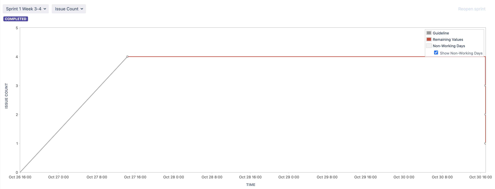
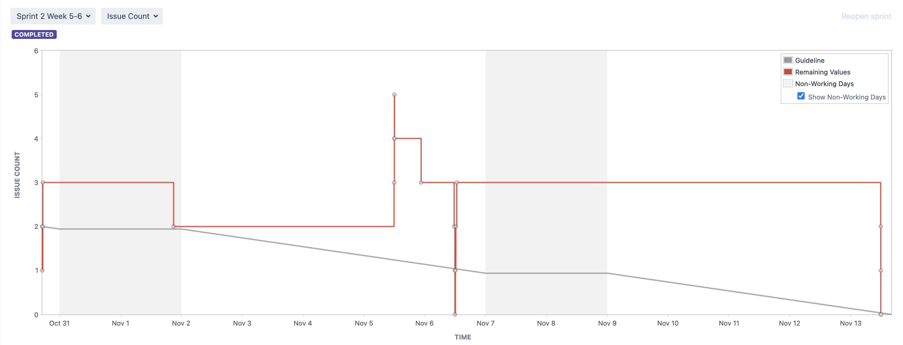
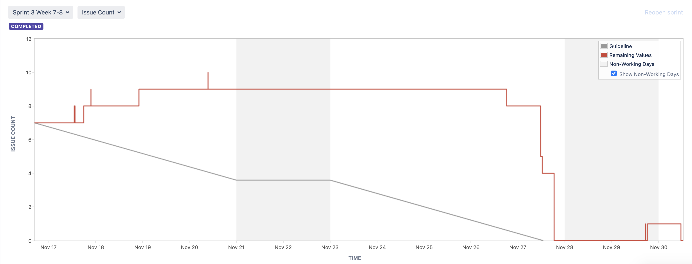
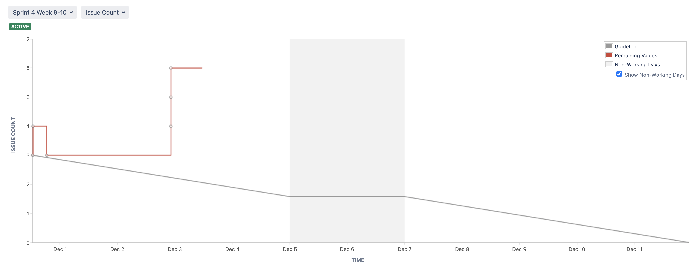
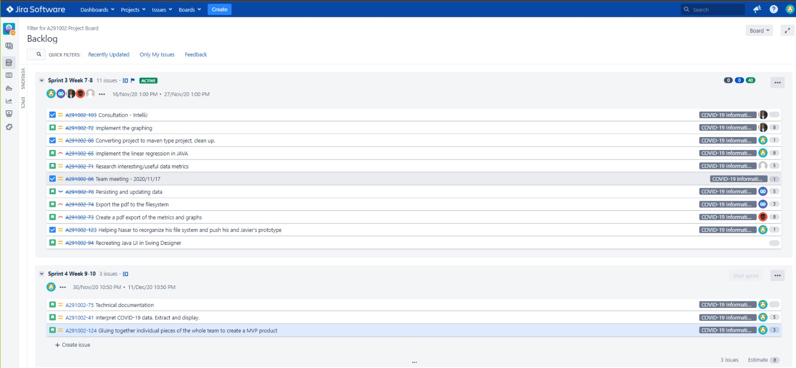
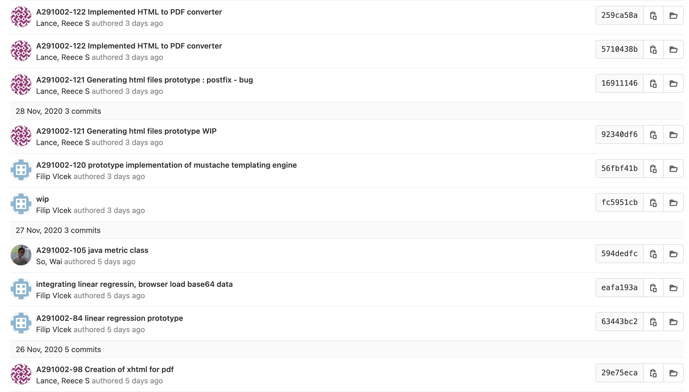
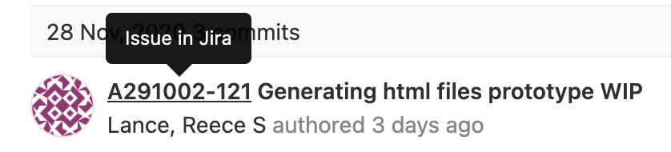
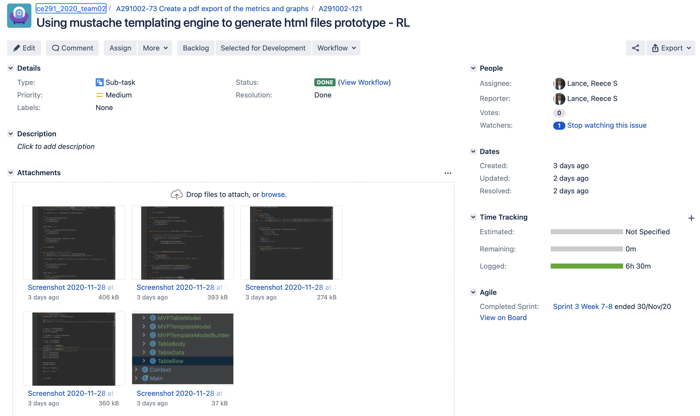

# Project Management Log

## Project management discussion

-How well the group has worked together?

The effort and commitment put in by each team member has been exceptional. Any problems that were encountered during the task, everybody was welcoming to help. 

-How well the project is progressing?

We practised splitting into subgroups to complete specific tasks that were planned at each scrum meeting. Each task/user-story assigned should be completed until the target date, or the end of the sprint passes. By doing this on every sprint, our project has been progressing smoothly to finalise the MVP.

Scrum meetings were held every week on Friday. Since we decided to split up into groups for each task, each group will present what they have done for the last sprint and problems that they have encountered. After each group has demonstrated, we will then discuss which task to pursue for the next sprint.

One way of making the scrum meeting more effective is to rotate the scrum master in every scrum meeting. The scrum master will be chosen at the start of every new sprint and will host the scrum meeting at the end of every sprint. By doing this, every group member will have the chance on how to become a scrum master.

Since we are currently studying under a COVID-19 pandemic, some of the group members are still staying in their own respective countries. The issues that were encountered during the project were that if we were to create a standup-meeting, we would have to make sure that we take into consideration the other group members' time zone's differences as well. 

As an example, if we were to make a standup meeting at 8 pm BST time and the other group members live in a place which is 8 hours ahead of us, it would not be ideal for the group member to join a meeting at 4 am.

The usefulness of us setting up some standup meetings, was to discuss any unspoken important materials that we were supposed to discuss or any updates on the project. For instance, in one of the lab meetings on Friday, we did not managed to discuss on what task we were supposed to during the following week due to time constraint. So, we set up a standup meeting on a Monday and discuss about it.

Sprint 3 standup: https://cseejira.essex.ac.uk/browse/A291002-86

Sprint 4 standup: https://cseejira.essex.ac.uk/browse/A291002-130

## Sprint Burndown Charts

**Sprint 1:**

We did not record a standup meeting on Jira during sprint 1

**Sprint 2:**

We did not record a standup meeting on Jira during sprint 2

**Sprint 3:**

Link to sprint 3 standup meeting:

https://cseejira.essex.ac.uk/browse/A291002-86

**Sprint 4:**

Link to sprint four standup meeting:

https://cseejira.essex.ac.uk/browse/A291002-130

## Burndown-Charts Discussion

The team burndown chart shows lots of ups and downs, that is because when the story points are assigned, they are assigned to the user-story/task itself, but while we work on the user-story/task we create subtasks so we can keep track of what we are doing, and until all the subtasks are finished completely we do not mark the task as done. That is why a better unit of measuring our team sprint burndown are issue counts.
For example, the burndown chart of the issue count in sprint 3 shows a better view of how the team has worked during sprints. You can see how some issues are being ticked off and marked as completed, and the adding of new issues in the sprint.

For last, to improve the velocity and the estimation ability for future sprints the team should be able to increase their independency and not rely on other team members to do the subtasks.

## Product Backlog

## Other Areas

## Use of Jira links in GitLab

In GitHub, when making commits, we made sure to include links to the sub-task in Jira which corresponded to what changes were made in the commit.

For example:

