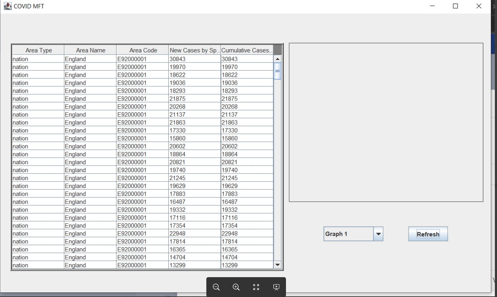

# Requirements and Risk Log

# Requirements

> Note: we assign stories to people who should make sure that the goals are achieved before the target or sprint end date passes. Individual sub-tasks are assigned to the pople actually working on them.

- Story: [Import of COVID-19 data](https://cseejira.essex.ac.uk/browse/A291002-39)
    - Description: As a user, I want to have access to up-to-date publicly available UK COVID-19 data. The app should at the users request pull in and store data from the following government webpages:  https://coronavirus.data.gov.uk/cases and https://coronavirus.data.gov.uk/deaths
    - Details: It has meen assigned and completed.

- Story: [Implement graphing](https://cseejira.essex.ac.uk/browse/A291002-72)
    - Description: As a user, I would like to see plotted graphs in the app's GUI. For example cases by specimen date. Plotting a simple line is sufficient for demonstration. Going forward plot the data already available in the app. 
    - Details: It has meen assigned and completed.

- Story: [Create a pdf export of the metrics and graphs](https://cseejira.essex.ac.uk/browse/A291002-73)
    - Description: As a user, I want to click a button and have a ready to go exported pdf document with graph and additional valid information. 
    - Details: It has meen assigned and completed.

- Story: [Gluing together individual pieces of the whole team to create a MVP product](https://cseejira.essex.ac.uk/browse/A291002-124)
    - Description: 
    1. create a HTML document for displaying in the graph field with the live data apply linear regression on the input data and construct a figure
        1. create the document with the figure and save it in app's temp folder
        1. load the local document in the browser
    1. export the pdf
        1. create an export model
        1. fill the export template with the model
        1. convert the resulting HTML file to pdf
        1. show the path to the user or open it up for him somehow
    1. integrate so wai's metrics in the covid-mft and show them to the user
        1. integrate so wai's work in the main project
        1. create corresponding UI fields
        1. fill in the fields on table refresh
    1. fake the piecewise linear regression by including hardcoded knots and use it in our displayed and exported graphs
    1. Cash the online data for resusing 
    - Details: It has meen assigned and completed.

## Risk Log

### Risk 1: [Overloading the Government API URL link](https://cseejira.essex.ac.uk/browse/A291002-144) 

#### Risk description - Since the data comes in a huge chunk, it runs a risk of overloading the government API since the data is directly fetched from the live website itself. 
1. Comments - To enable caching the data for a few hours, before you ask for brand new data as the data itself is updated daily. This would resolve the risk of overloading the API. 
2. Impact - Major. 
3. Likelihood - Possible. 
4. This story has been assigned to 3 people, and it has been resolved. 5. Nasar, Filip and Javier have mitigated the risk by caching the data before asking for new data.

### Risk 2: [Running an older version of the browser. URL link](https://cseejira.essex.ac.uk/browse/A291002-147)

#### Risk description - The projects heavily depend on the correct version of the browser. For example, it runs only on Java 8 currently, other versions do not support the project. 
1. Comments - To build our own from JCEF source code. This would eliminate the risk. 
2. Impact - Moderate. 
3. Likelihood - Certain. 
4. Since we require the MVP currently, it has not been worked on yet. But we do have Reece and Dean on it.

### Risk 3: [Inaccurate predictions - Linear regression. URL link](https://cseejira.essex.ac.uk/browse/A291002-150) 

#### Risk description - We are using linear regression to get the knots on  our graph and predict future values. It does not provide a measure of data's fit. 
1. Comments - Still working on it. 
2. Impact - Moderate. 
3. Likelihood - Certain. 
4. Since we require the MVP currently, it has not been worked on yet. But we do have Sanskar and Filip on it.

